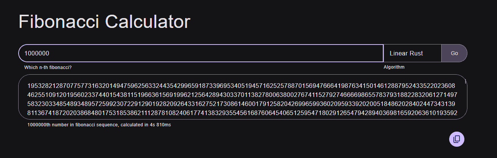

<div align="center">

# `fibonacci-toy-website`

**One more webpage to calculate lucky numbers.**

</div>

[](https://wyvernixtl.github.io/fibonacci-toy-website/)

## Building

### Prerequisites

* [Rust](https://www.rust-lang.org/tools/install)
* [`wasm32-unknown-unknown`](https://doc.rust-lang.org/nightly/rustc/platform-support/wasm32-unknown-unknown.html)  
  Installable via `rustup`: `rustup target add wasm32-unknown-unknown`
* [Bun](https://bun.sh/)
* [`wasm-pack`](https://rustwasm.github.io/wasm-pack/installer/)  
  Installable via `bun`: `bun install -g wasm-pack`  
  Installable via `cargo`: `cargo install wasm-pack`


### Build

```
cd ./fibonacci-toy-rs-4-web
wasm-pack build --release
cd ..
bun i
bun run build
```
